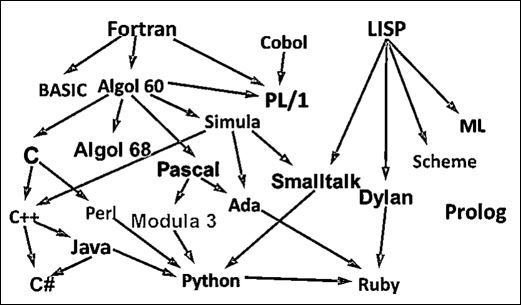
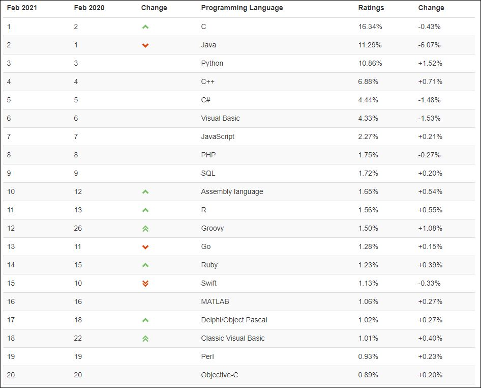
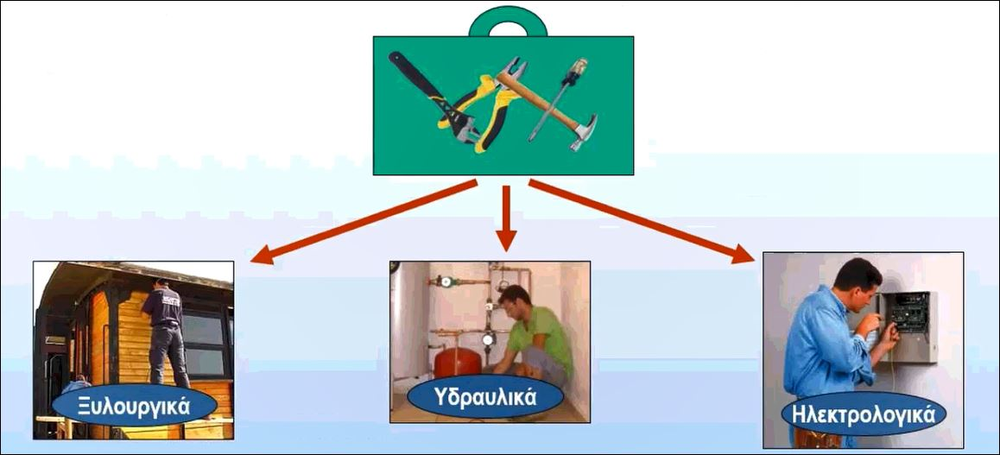
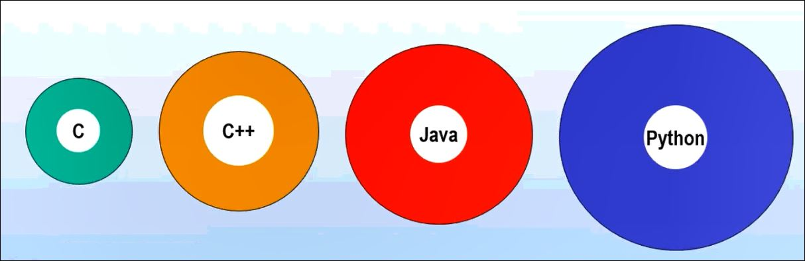
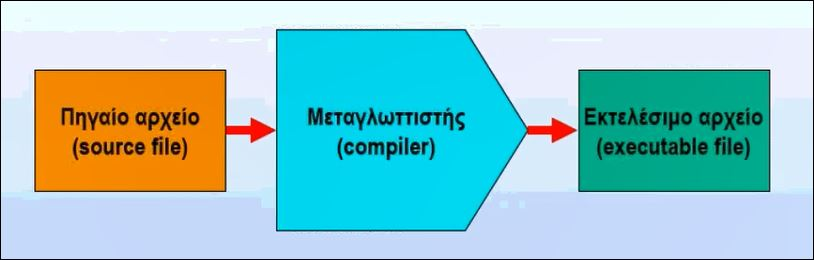
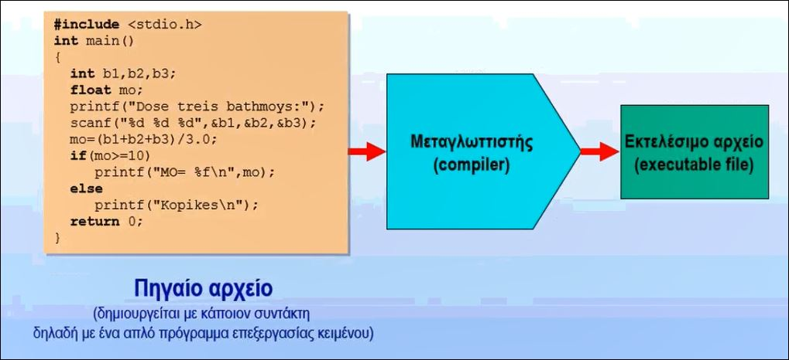

[](https://hits.seeyoufarm.com)

# Διάλεξη 1

Οι παρακάτω σημειώσεις είναι απο τη παρουσίαση (17/02/2021) του κ. Νίκου Μ. Χατζηγιαννάκη (Πανεπιστήμιο ΑΙΓΑΙΟΥ) και έχουν σκοπό να βοηθήσουν τους φοιτητές/τριες που δεν μπόρεσαν τη συγκεκριμένη μέρα να παρακολουθήσουν τη διάλεξη. Το περιεχόμενο της διάλεξης ήταν το εξής:

- Η εξέλιξη των γλωσσών προγραµµατισµού
- Η θέση της C
- Ιστορικά στοιχεία
- Μεταγλώττιση προγραµµάτων στη C
- Ολοκληρωµένα περιβάλλοντα - Το περιβάλλον DEV-C
- Χρήση της µνήµης από τη C
- Τύποι δεδοµένων
- Μεταβλητές
- Σταθερές
- Παραστάσεις

## Γιατί να μάθω C ?


Γιατί μαθαίνουμε άραγε προγραμματισμό; Ο Steve Jobs είχε πει χαρακτηριστικά ότι ο καθένας πρέπει να μάθει να προγραμματίζει έναν υπολογιστή γιατί αυτό μας διδάσκει πως θα σκεφτόμαστε. Δηλαδή με απλά λόγια μας μαθαίνει μια *δομημένη σκέψη* η οποία μας ακολουθεί παντού και όχι μόνο απαραίτητα στον προγραμματισμό.

Τώρα θα αναρωτηθεί κάποιος, γιατί πρέπει να μάθω την γλώσσα προγραμματισμού C; Γιατί να μην μάθουμε μια άλλη γλώσσα προγραμματισμου με περισσότερες δυνατότητες;


Η απάντηση είναι πολύ απλή! Η C μας βοηθάει να εμβαθύνουμε στους μηχανισμούς που υπάρχουν πίσω από οποιαδήποτε άλλη γλώσσα προγραμματισμού. Είναι η μόνη γλώσσα ανωτέρου επιπέδου που μπορεί να επικοινωνήσει με τον υπολογιστή σε τόσο χαμηλό επίπεδο. Και για αυτόν τον λόγο είναι μία γλώσσα που χρησιμοποιείτε σε διάφορους τομείς της Ρομποτικής και σε διάφορους μικροελεγκτές. Επίσης σε αυτήν την γλώσσα είναι στηριγμένες οι πιο σύγχρονες γλώσσες προγραμματισμού όπως είναι η C++, η C# και η Java. Η Python μην ξεχνάμε δεν ανήκει σε αυτές!

## Από τη Python στη C


Ο κ. Χατζηγιαννάκης στη παρουσίαση του παρομοίωσε την Python σαν ένα σκουτεράκι όπου ο καθένας μπορεί να το οδηγήσει αν ξέρει ισορροπία. Απλά ανοίγει το γκάζι και φεύγει! Αντιθέτως η C είναι μια πιο περίπλοκη μηχανή που εκεί φυσικά δεν ανοίγουμε απλά το γκάζι και φεύγουμε. Πρέπει να γνωρίζουμε πως αλλάζουμε ταχύτητες και πως χρησιμοποιούμε σωστά τον συμπλέκτη.

Η Python έχει τα εξής **πλεονεκτήματα**:

- Μας καλομαθαίνει γιατί πολλά πράγματα γίνονται αυτόματα.
- Είναι εύκολη στη χρήση της.
- Υπάρχουν πολλά έτοιμα προγράμματα στη βιβλιοθήκη της και μπορούμε να τα χρησιμοποιήσουμε χωρίς να χρειαστεί να τα φτιάξουμε εμείς οι ίδιοι.
- Διαθέτει πιο απλή σύνταξη εντολών.

Τα **μειονεκτήματα** της Python:

- Έχει μικρή ταχύτητα.
- Έχουμε λιγότερο έλεγχο στον υπολογιστή μας.
- Δεν εμβαθύνουμε στους εσωτερικούς μηχανισμούς της γλώσσας.
- Δεν έχει άμεση σχέση με άλλες δημοφιλείς γλώσσες όπως η C, C++, C# και Java.

Η C έχει τα εξής **πλεονεκτήματα**:

- Έχει μεγάλη ταχύτητα.
- Έχει πλήρη έλεγχο.
- Εμβαθύνουμε πλήρως στους εσωτερικούς μηχανισμούς.
- Έχει άμεση σχέση με άλλες δημοφιλείς γλώσσες όπως είναι η C++, C# και Java.

Η C έχει τα εξής **μειονεκτήματα**:

- Τίποτα δεν γίνεται αυτόματα.
- Πιο δύσκολη στην χρήση της.
- Η βιβλιοθήκη της είναι πιο περιορισμένη, δηλαδή πολλά πράγματα χρειάζεται να τα κάνουμε εμείς και δεν τα βρίσκουμε έτοιμα.
- Υπάρχει στατική διαχείρηση της μνήμης.
- Υπάρχει πιο απαιτητικό περιβάλλον εκεί που γράφουμε και εκτελούμε τα προγράμματα.
- Η σύνταξη των εντολών είναι πιο σύνθετη και πιο ελεύθερη.

## Η εξέλιξη των γλωσσών προγραμματισμού

Στην παρακάτω εικόνα παρατηρούμε ότι όλες οι σύγχρονες γλώσσες προγραμματισμού που χρησιμοποιούνται στον προγραμματισμό έχουν σαν βάση την C. Άρα μαθαίνοντας εμείς την C ουσιαστικά έχουμε μάθει και ένα μεγάλο κομμάτι των υπόλοιπων γλωσσών προγραμματισμού που ξεκινάν απο αυτήν.



## Δημοτικότητα γλωσσών προγραμματισμού (Φεβρουάριος 2021)

Εδώ βλέπουμε την τελευταία δημοτικότητα των γλωσσών προγραμματισμού. Παρατηρούμε ότι νούμερο 1 φέτος είναι η γλώσσα C. Κατά την διάρκεια των σπουδών μας στο ΤΠΤΕ θα μάθουμε και τις 4 πιο δημοφιλής γλώσσες προγραμματισμού του κόσμου (C, Java, Python και C++).



## Τι είναι ένα προγραμμα ?

Ένα πρόγραμμα είναι η απεικόνιση της λύσης ενός προβλήματος στον υπολογιστή. Δηλαδή εαν θέλουμε να λύσουμε ένα πρόβλημα, πρέπει να δώσουμε στον υπολογιστή μας τις κατάλληλες εντολές έτσι ώστε να μπορέσει να λυθεί. Και φυσικά πρέπει πριν πάμε να το λύσουμε, να το έχουμε λύσει εμείς οι ίδιοι στο μυαλό μας.

Δηλαδή εαν θέλουμε να υπολογίσουμε τον μέσο όρο 3 αριθμών, πρέπει αρχικά να ξέρουμε εμείς οι ίδιοι πως θα το κάνουμε. Θα πρέπει δηλαδή να τους προσθέσω και να τους διαιρέσω διά το πλήθος τους. Και στην συνέχεια με μία κωδικοποιήση  (δηλαδή μία γλώσσα προγραμματισμού) να το δώσω στον υπολογιστή για να το εκτελέσει.

## Η "εργαλειοθήκη" των γλωσσών προγραμματισμού



Οι γλώσσες προγραμματισμού μας διαθέτουν και κάποια έτοιμα εργαλεία. Δηλαδή ανάλογα με το τι θέλουμε να κάνουμε, όπως έχουμε μια εργαλειοθήκη που άλλα εργαλεία έχουμε για τα ξυλουργικά μας, άλλα για τα υδραυλικά και άλλα για τα ηλεκτρολογικά, έτσι και οι γλώσσες προγραμματισμού διαθέτουν ένα εύρος από έτοιμα προγράμματα, τα οποία αποτελούν την βιβλιοθήκη της γλώσσας.

## Βιβλιοθήκες των γλωσσών C, C++, Java και Python

Κάθε γλώσσα προγραμματισμού περιβάλλεται εκτός απο τις βασικές της εντολές και απο τις έτοιμες βιβλιοθήκες (ή αλλιώς συναρτήσεις). Στην παρακάτω εικόνα φαίνετε με άσπρο χρώμα ο πυρήνας της κάθε γλώσσας και από έξω με διαφορετικό χρώμα αντιπροσωπεύεται η βιβλιοθήκη της γλώσσας. Παρατηρούμε ότι η C έχει μία μικρή σχετικά βιβλιοθήκη. Όσο μεγαλύτερη είναι η βιβλιοθήκη της γλώσσας, τόσο πιο εύκολη είναι, επειδή έχουμε έτοιμα πράγματα να χρησιμοποιησουμε αλλά τόσο λιγότερο καταλαβαίνουμε το πώς γίνονται αυτά τα πράγματα. Άρα μαθαίνουμε λιγότερο τον μηχανισμό.



## Η μεταγλώττιση ενός προγράμματος

Οποιαδήποτε γλώσσα προγραμματισμού για να εκτελεστεί πρέπει να μετατραπεί σε γλώσσα μηχανής. Ο υπολογιστής καταλαβαίνει μόνο 0 και 1. Το αρχείο που έχει το πρόγραμμα σε γλώσσα υψηλού επιπέδου λέγεται πηγαίο αρχείο Η δουλειά του μεταγλωτιστή δηλαδή είναι να μετατρέψει τον πηγαίο κώδικα σε μια σειρά απο 0 και 1 (μετάφραση). Το αποτέλεσμα αυτής της μετάφρασης είναι το εκτελέσιμο αρχείο που οι εντολές είναι σε 0 και 1 που δεν τις καταλαβαίνουμε εμείς, αλλά τις καταλαβαίνει ο υπολογιστής. Αυτή είναι πολύ περιληπτικά η διαδικασία της μεταγλώττισης ενός προγράμματος.



Στην παρακάτω εικόνα έχουμε ένα παράδειγμα με ένα πηγαίο αρχείο το οποίο θα μεταγλωττιστεί σε ένα εκτελέσιμο αρχείο. Φυσικά εμείς δεν καταλαβαίνουμε το 0 και 1, άλλα είναι οι αντίστοιχες εντολές σε γλώσσα μηχανής τις οποίες τις καταλαβαίνει μόνο ο υπολογιστής και τις εκτελεί. Εμείς γράφουμε το πηγαίο αρχείο, ο μεταγλωττιστής το μεταφράζει σε εκτελέσιμο αρχείο και στην συνέχεια αυτό το αρχείο το εκτελεί ο υπολογιστής.



## Αλήθεια τι µέρα έχουµε σήµερα; έφαγα πρωινό; πως µε λένε;

Ένα βασικό μέλημα του υπολογιστή είναι να διατηρεί κάποια δεδομένα που του εισάγει ο χρήστης. Αρχικά θα προσομοιάσουμε έναν υπολογιστή με έναν άνθρωπο ο οποίος έχει Alzheimer και δεν θυμάται τίποτα. Η μνήμη του είναι μηδενική και δεν θυμάται τι έκανε το προηγούμενο δευτερόλεπτο. Ο καλύτερος τρόπος για έναν τέτοιο άνθρωπο να γίνει λειτουργικός είναι να αρχίσει να σημειώνει σε χαρτάκια ότι θέλει να θυμάται. Ένας υπολογιστής λοιπόν θα πρέπει να τον φανταστούμε σαν έναν τέτοιο άνθρωπο που δεν θυμάται τίποτα, εκτός και εάν αυτή την πληροφορία την έχει κάπου αποθηκευμένη. Φανταζόμαστε λοιπόν ότι η πληροφορία αυτή αποθηκέυετε σε κάποια κουτάκια. Το κάθε κουτάκι απέξω έχει έναν τίτλο και μέσα σε αυτό είναι η αποθηκευμένη η κάθε πληροφορία. Έτσι δουλέυει ο οποιοσδήποτε ηλεκτρονικός υπολογιστής.

## Η διαχείριση της μνήμης RAM

Τα κουτάκια όμως που αναφέραμε προηγουμένος, δηλαδή τα κουτάκια μνήμης, είναι η κεντρική μνήμη RAM του υπολογιστή. Εκεί μέσα υπάρχουν δισεκατομμύρια τέτοια κουτιά μέσα στα οποία ο υπολογιστής αποθηκεύει τις πληροφορίες και τα αποτελέσματα της επεξεργασίας των δεδομένων που έχει μέσα. Όταν λέμε ότι ο υπολογιστής μας έχει μνήμη 6 Gigabyte εννοούμε ότι έχει 6 δισεκατομμύρια τέτοια κουτάκια. Κάθε κουτάκι έχει και έναν αύξοντα αριθμό. Η μνήμη RAM χρησιμοποιεί αυτά τα κουτάκια για να αποθηκεύσει τις πληροφορίες. Επίσης δεν ξεχνάμε ότι άμα κλείσουμε τον υπολογιστή μας, ότι υπάρχει μέσα σε αυτά τα κουτάκια χάνεται. Η μνήμη RAM είναι μία μνήμη που κρατάει τις πληροφορίες όσο χρονικό διάστημα ο υπολογιστής είναι ανοικτός.

## Η χρήση των θέσεων µνήµης

Για να χρησιμοποιήσουμε κάποια τέτοια θέση μνήμης, επειδή είναι δύσκολο να θυμόμαστε τον αύξοντα αριθμό, είναι προτιμότερο να δώσουμε στο κουτάκι αυτό ένα όνομα, το οποίο έχει νόημα για εμάς. Στην παρακάτω εικόνα παίρνουμε ένα κουτί και του δίνουμε το όνομα `apa` (απάντηση) και βάζουμε μέσα τον χαρακτήρα `N` (ΝΑΙ). Παίρνουμε ένα 2ο κουτί `etos` και βάζουμε μέσα την τιμή `1992` που δηλώνει το έτος γέννησης μας. Και τέλος παίρνουμε και ένα 3ο κουτί με όνομα `ilikia` και βάζουμε μέσα την ηλικία μας η οποία είναι `25`. Άρα ναι μεν χρησιμοποιούμε την μνήμη RAM αλλα επειδή το 1ο κουτί έχει τη διεύθυνση `000002` μας είναι πολύ πιο εύκολο να το θυμόμαστε σαν `apa` αυτό το κουτί και όχι σαν `000002` διότι το όνομα `apa` έχει περισσότερο νόημα για εμάς.

## Η έννοια της μεταβλητής

Ας υποθέσουμε ότι έχουμε το κουτί `ilikia` με τον αριθμό `12`. Στη συνέχεια μπορούμε να βγάλουμε το `12` και να βάλουμε έναν άλλο αριθμό π.χ το `23`. Παρατηρούμε ότι η μεταβλητη (το κουτί) `ilikia` παραμένει ίδιο ενώ το περιεχόμενο της (η τιμή της) μεταβάλλεται. Θα φανταζόμαστε την μεταβλητή σαν ένα κουτί. Το περιεχόμενο μιας θέσης μνήνης μπορεί να μεταβάλλεται. Το όνομα μιας θέσης μνήμης καλείται **μεταβλητή** και το περιεχόμενο της θέσης μνήμης αποτελεί την **τιμή** της μεταβλητής.

## Ονοματολογία

Τα διάφορα ονόματα που δίνουμε στις μεταβλητές έχουν κάποιους περιορισμούς και κάποιους κανόνες. Στη C τα ονόματα πρέπει να περιέχουν μόνο γράμματα και αριθμούς και κάτω παύλες (`_`). Δεν επιτρέπονται τα κενά και οι ελληνικοί χαρακτήρες. Επίσης δεν επιτρέπονται άλλα σύμβολα και το όνομα θα πρέπει να ξεκινάει από γράμμα και όχι αριθμό. Τέλος δεν επιτρέπεται να χρησιμοποιηθούν σαν ονόματα οι δεσμευμένες λέξεις της γλώσσας.

Στη C, **κεφαλαίοι** και **πεζοί** χαρακτήρες είναι διακριτοί. Δηλαδή η μεταβλητη `d` είναι διαφορετική απο την `D`. Συνήθως χρησιμοποιούμε πεζούς χαρακτήρες για τις μεταβλητές.

## Αποδεκτά και μη αποδεκτά ονόματα μεταβλητών

**Αποδεκτά** ονόματα μεταβλητών:

- `synolo`
- `A1`
- `teliko_synolo`
- `NIKOS`
- `a345`

**Μη αποδεκτά** ονόματα μεταβλητών:

- `1a`
- `ab$`
- `teliko synolo`
- `a-b`
- `ΝΙΚΟΣ`

## Τύποι δεδομένων

Ένας υπολογιστης χειρίζεται **αριθμούς** και **χαρακτήρες**. Η C που είναι στατικού τύπου, θέλει από την αρχή να καθορίσουμε τι θα μπει στη μεταβλητή. Δηλαδή είναι σαν να παίρνω ένα κουτί, και να λέω ότι σε αυτό το κουτί θα βάζω μόνο αριθμούς. Δεν μπορώ στη συνέχεια να βάλω χαρακτήρες. Αυτή είναι η διαφορά μεταξύ του δυναμικού και του στατικού τύπου. Στην Python μπορούσαμε να βάλουμε στο ίδιο κουτί διαφορετικού τύπου δεδομένα.

Στη C πρέπει να χρησιμοποιήσω άλλο τύπο μεταβλητής για να βάλω έναν χαρακτήρα, άλλο τύπο μεταβλητής για να βάλω εναν ακέραιο αριθμό και άλλο τύπο μεταβλητής για έναν πραγματικό αριθμό.

Στη C σε κάθε μεταβλητή μπορούμε να καταχωρήσουμε τιμές συγκεκριμένου τύπου. Η C δεσμεύει για κάθε μεταβλητή τον απαιτούμενο αποθηκευτικό χώρο. Πρέπει από την αρχή ο Η/Υ να γνωρίζει τι είδους είναι η κάθε μεταβλητή για να δεσμεύσει τον απαιτούμενο αποθηκευτικό χώρο. Οι γλώσσες που διαχειρίζονται τη μνήμη με αυτόν τον τρόπο λέγονται γλώσσες **στατικού** τύπου.

Φανταζόμαστε σαν να πηγαίνουμε σε ένα σούπερ μάρκετ και στα ράφια είναι τα διάφορα πράγματα, τα οποία μπορούμε να χρησιμοποιήσουμε στον υπολογιστή μας. Αυτά τα ράφια έχουν ακέραιους αριθμούς, πραγματικούς, χαρακτήρες και πραγματικούς αριθμούς με πολλα δεκαδικά ψηφία. Αυτά τα 4 πράγματα είναι το βασικό είδος πληροφορίας που μπορεί να διαχειριστεί η C. Δηλαδή μπορεί να διαχειριστεί ακέραιους αριθμούς (2, 8, 44, -3), πραγματικούς αριθμούς αλλά με λίγα δεκαδικά (2.3, 5.44, -8.5, 6.0), πραγματικούς αριθμούς με πολλά δεκαδικά, δηλαδή με μεγάλη ακρίβεια (3.14578, 55,777899) και χαρακτήρες (`'Α'`, `'*'`, `'$'`, `'Λ'`).

## Στατική διαχείριση μνήμης

Αν πάμε σε ένα κατάστασημα και ζητήσουμε να μας δώσουν ένα κουτί, το πιθανότερο είναι ότι θα μας ρωτήσουν τις διαστάσεις του ή ακόμα πιο πιθανό τι το θέλουμε και το τι πρόκειται να αποθηκεύσουμε μέσα.

Άλλο μέγεθος κουτί θα πάρουμε για παπούτσια, άλλο για μπότες, άλλο για τηλεόραση, άλλο για κινητό, κ.λ.π. Επομένως, αν δεν θέλουμε να σπαταλάμε χώρο, το μέγεθος του κουτιού εξαρτάται από το τι θέλουμε να αποθηκεύσουμε.

Ένας Η/Υ δεν μπορεί να αποθηκεύσει παπούτσια ούτε μπότες ούτε κινητά. Τα δεδομένα που χειρίζεται ένας Η/Υ είναι αριθμοί, χαρακτήρες, σύνολα χαρακτήρων και λογικές τιμές.

Επομένως ο Η/Υ για να μας διαθέσει τον απαιτούμενο αποθηκευτικό χώρο για μια μεταβλητή, θα πρέπει να γνωρίζει το τι θα βάλουμε μέσα, δηλαδή τον **τύπο δεδομένων** που θα αποθηκεύσουμε σε αυτή τη μεταβλητή.

## Οι βασικοί τύποι δεδομένων της C

Η C υποστηρίζει 4 βασικούς τύπους δεδομένων:

- int
- char
- float
- double

Ο τύπος δεδομένων **int** αναφέρεται σε ακέραιους αριθμούς. Ο τύπος δεδομένων **char** αναφέρεται σε χαρακτήρες. Ο τύπος δεδομένων **float** αναφέρεται σε πραγματικούς αριθμούς (δεκαδικούς αριθμούς). Ο τύπος δεδομένων **double** αναφέρεται επίσης σε πραγματικούς αριθμούς με περισσότερη όμως ακρίβεια στα δεκαδικά ψηφία.

Μέχρι τώρα που προγραμματίζαμε στη Python χρησιμοποιούσαμε μια μεταβλητή χωρίς να προσδιορίσουμε προηγουμένως τον τύπο δεδομένων της. Αυτό γινόταν αυτόματα. Στη C όπως και σε άλλες πολλές γλώσσες προγραμματισμού, πρέπει πρώτα να δηλώσουμε τον τύπο δεδομένων της μεταβλητής αυτής. Δηλαδή παίρνουμε ένα κουτί τέτοιο ώστε να μπορούμε να βάλουμε έναν ακέραιο αριθμό ή ένα κουτί τέτοιο, ώστε να μπορούμε να βάλουμε έναν πραγματικό αριθμό απλής ή διπλής ακρίβειας.

Για κάθε τύπο δεδομένων, υπάρχουν **μεταβλητές**, **σταθερές** και **παραστάσεις**.

## Μεταβλητές

Μεταβλητές είναι θέσεις μνήμης που τις έχουμε αποδώσει ένα όνομα και το περιεχόμενο τους μπορεί να μεταβληθεί. Η C υποστηρίζει 3 βασικούς τύπους μεταβλητών:

- **int** &rarr; Μεταβλητές στις οποίες καταχωρείται ένας ακέραιος αριθμός.
- **char** &rarr; Μεταβλητές στις οποίες καταχωρείται ένας χαρακτήρας.
- **float** και **double** &rarr; Μεταβλητές στις οποίες καταχωρείται ένας πραγματικός αριθμός (με δεκαδικά ψηφία).

```c
int etos = 2009;
char ans = 'N';
float mo = 7.5;
double mo = 7.5;
```

## Σταθερές

Εκτός από τις μεταβλητές έχουμε και τις σταθερές. Σταθερές είναι προκαθορισμένες τιμές που δεν μεταβάλλονται κατά την διάρκεια εκτέλεσης ενός προγράμματος. Η C υποστηρίζει τρεις βασικούς τύπους σταθερών:

- **int** &rarr; Ακέραιοι αριθμοί
- **char** &rarr; Ένας χαρακτήρας μέσα σε απλά εισαγωγικά
- **float** και **double** &rarr; Πραγματικοί αριθμοί με δεκαδικά ψηφία
